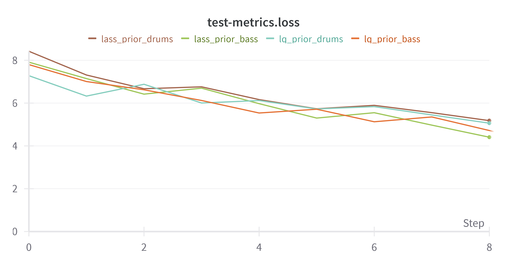

# LQVAE-LASS-hybrid
Project for the exam of Deep Learning &amp; Applied AI @Sapienza [2022/2023]

**Task**: Students will be required to compare the source separation music performance of the **LQ-VAE** model and the **LASS** model by re-training both models using publicly available datasets. They will then train a model with a loss function as in LQ-VAE, but using the technique of counting occurrences in the model codebook at inference time, as is done in LASS. The project aims to assess whether this hybrid approach can lead to better separation performance while maintaining efficiency at inference time.

This repository contains the following three models:

*   [LQVAE](https://github.com/michelemancusi/LQVAE-separation) | [paper](https://arxiv.org/abs/2110.05313)
*   [LASS](https://github.com/gladia-research-group/latent-autoregressive-source-separation) | [paper](https://arxiv.org/abs/2301.08562)
*   Hybrid

All models leverage their architecture from the paper [Jukebox: A Generative Model for Music](https://arxiv.org/abs/2005.00341).

## Implementation

The project was completed using **Google Colab**. The GPU at my disposal could not have achieved the same results in a sensible time compared to the T4 offered by the service. However, the time limit of 3 hours per day imposed constraints on the amount of available time for both training and testing. Despite multiple restarts, this limitation will be evident in the results and the quantity of data utilized, particularly in comparison to the original works.

The complete workflow can be found inside [*'LQVAE_LASS_hybrid.ipynb'*](./LQVAE_LASS_hybrid.ipynb). The notebook is structured into three primary sections: the initial part manages the setup for the correct Python environment and MPI library, the following installs the various dependencies required for the desired model, and the last section presents a sequence of command lines to start the training and testing.

The task involves training a model using the loss function specified in LQ-VAE, while also counting occurrences in the model codebook to compute the likelihood, as in LASS. The code for LQVAE-LASS-hybrid is derived from the original LQ-VAE code to fulfill the initial requirement. To complete the second request, the likelihood within the ancestral sampling is now calculated using the sparse occurrence matrix, the ancestral sample function can be found [here](./LQVAE-LASS-hybrid/script/bayesian_test.py). The best solutions generated by the model are still selected individually, as in LQ-VAE, since the rejection samplig seems generally to still yield lower metrics. For LASS and LQ-VAE only small changes have been applied to the code, mostly to accommodate a common data loader structure for all models.

## Data

The data used to train the models is from [Synthesized Lakh (Slakh) Dataset](http://www.slakh.com/), specifically focusing on bass and drums instruments. From the entire dataset only 600 songs, each sampled at 22050Hz, were selected from the complete dataset, 300 for bass and another 300 for drums. These individual sources were then paired to form a mixture, resulting in 300 mixtures. This straightforward process is detailed in the code [*'slakh_scrape.py'*](./data/slakh_scrape.py.py). Finally, the mixtures and corresponding sources (bass and drums) were finally divided into 210 samples for training and 90 samples for testing. The modest number of samples is attributed to limitations in computational resources.

## Experiments

To conduct the comparison between models each model was tested on 30 chunks of 3 seconds, the chunks were extracted from the first 30 test mixtures. The produced samples are then compared to the original sources through Signal to Distortion Ratios (SDR). The following table reports the performance of all methods over the two instrument classes. The scores represent the average SDR of the best-generated samples compared to the original sources, calculated over the 30 chunks. The best sample is individually picked since rejection sampling yields worse performance.

| Separation method | Bass | Drums | Avg. separation time (s) |
| ---------|:----------:|:----------:|:----------:|
| LQ-VAE | 3.41 | 5.41 | 254.77 |
| LASS | 3.22 | 4.78 | 148.57 |
| Hybrid | 4.72 | 5.15 | 148.4 |

To better illustrate the separation performance it's useful to see a comparison of the SDR between the two classes, SDR_0 refers to bass and SDR_1 refers to drums. If both classes show high values it means that the separation was successful.

<!-- ![lq-vae_sdr]](./images/LQ_sdr_plot.svg) -->

During the training process, all meaningful metrics were logged on Weights and Biases. Here, a sequence of raw plots illustrates the cumulative loss values for the VQ-VAE and priors, the **x-axis indicates the number of epochs**. The VQ-VAE exhibits promising results from the outset; however, the test loss for both the prior and VQ-VAE could potentially have been lower with additional epochs. Unfortunately, the limitations of Colab hours imposed a strict schedule, affecting the extent of training.

VQ-VAE loss for train and test:

Priors loss for train and test:

## Samples

To conclude, here are some samples of source separation for all methods:

---

Original Bass:

https://github.com/Pieroni1704202/LQVAE-LASS-hybrid/assets/50545485/725ac4dc-a979-4144-a509-c37f98f35a0e

Original Drums:

https://github.com/Pieroni1704202/LQVAE-LASS-hybrid/assets/50545485/716ca0b9-0e99-45ee-9f67-48bedb3f769a

Mixture:

https://github.com/Pieroni1704202/LQVAE-LASS-hybrid/assets/50545485/0a74e208-2fa0-47d8-ab55-9cf27301cb28

---

LQ-VAE Bass:

https://github.com/Pieroni1704202/LQVAE-LASS-hybrid/assets/50545485/d3dcadb6-7779-44b6-81b7-16ba7ab26227

LQ-VAE Drums:

https://github.com/Pieroni1704202/LQVAE-LASS-hybrid/assets/50545485/75ee2653-18f8-4191-9c5a-4b3f9cf1fe8e

---

LASS Bass:

https://github.com/Pieroni1704202/LQVAE-LASS-hybrid/assets/50545485/d2ac9c75-8b46-4a02-bb55-5a9beecfd1a6

LASS Drums:

https://github.com/Pieroni1704202/LQVAE-LASS-hybrid/assets/50545485/bd9f7b8a-5e94-4f34-8101-5d79a5cfd744

---

Hybrid Bass:

https://github.com/Pieroni1704202/LQVAE-LASS-hybrid/assets/50545485/2316ec91-94b7-43da-ae83-f022c28a36fa

Hybrid Drums:

https://github.com/Pieroni1704202/LQVAE-LASS-hybrid/assets/50545485/2ac6bf9c-7b49-4242-949c-d6f9224df8cd

